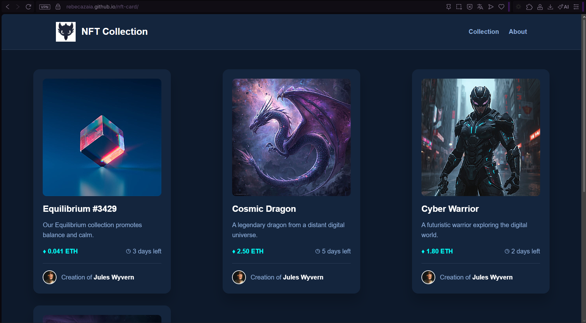

# NFT Collection

Projeto de desenvolvimento frontend, com o objetivo de criar uma interface responsiva para exibição de uma coleção de NFTs.

## Sobre o projeto

O projeto apresenta uma coleção de NFTs em cards individuais, contendo imagem, nome, descrição, preço, tempo restante e informações sobre o criador.

A interface também possui um Header com logo personalizada, efeitos de hover e animações de entrada.

## Tecnologias utilizadas

- React
- JavaScript
- HTML
- CSS
- Vite
- Animate.css

## Funcionalidades

- Exibição de múltiplos cards NFT
- Diferentes imagens e informações para cada card
- Layout responsivo
- Header com logo personalizada
- Efeito de hover nos cards
- Animações de entrada
- Adaptação para dispositivos móveis, tablets e desktops

## Preview

## Links

- [GitHub]
(https://github.com/RebecaZaia/nft-card)
- [GitHub Pages]
(https://rebecazaia.github.io/nft-card/)

## Autora

**Rebeca Zaia**

Estudante de Informática 6A — IFMS